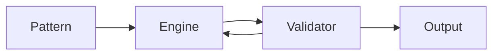

# origin-key-generator-utility 🔑✨

  

*A single tool, one clean interface, and an entire workflow for generating Origin-format identifiers — built because I got tired of duct-taping scripts together.*

  

## 🌱 Overview

**I built origin-key-generator-utility because I needed it myself — and then couldn't stop improving it.** This is a passion project born from countless late nights wrangling identifier formats, checksum rules, and validation quirks that most tools either ignore or get wrong. What started as a personal script folder slowly turned into a proper standalone utility with a real interface, real settings, and a real release cycle.

At its core, this is an **origin key generator** designed for developers, QA testers, system integrators, and hobbyists who need to produce syntactically valid identifiers in bulk or one at a time. It doesn't just spit out random strings — it respects formatting conventions, supports pattern templates, and gives you control over length, character sets, and structural segments. Whether you're stress-testing a validation pipeline, populating a test database, or just exploring how these identifier systems are constructed, this tool gets you there without friction.

Why does this exist in 2026 when there are a dozen half-finished alternatives out there? Because most of them are abandoned, bloated with ads, or require a dependency chain longer than the README itself. This one is **standalone, fast, and actually maintained.** No accounts, no telemetry, no nonsense — just a focused Windows utility that does one job extremely well.

> [!NOTE]
> This project is intended for testing, development, and educational exploration of identifier generation systems — not for circumventing any licensing or authentication mechanism.

---

## 🧩 What It Actually Does

| Capability | Why It Matters |
|---|---|
| **Pattern-aware generation** | Define your own template — segment lengths, separators, casing — and the engine builds every output around it. |
| **Batch mode** | Generate hundreds or thousands of entries in one pass, exportable straight to a file. |
| **Checksum-aware logic** | Optional validation layer ensures generated strings pass common structural checks, not just random noise. |
| **Duplicate-safe output** | Built-in de-duplication so your batch never repeats itself silently. |
| **Instant clipboard copy** | One click sends your result straight to the clipboard — no dragging across windows. |
| **History log** | Every session keeps a local, session-only history so you can revisit recent generations. |
| **Theming** | Light and dark interface modes, because eye strain isn't a feature. |
| **Portable build** | Runs from a single executable — no installer, no registry footprint. |

 

  

---

## 🚀 How To Get Started

1. **Visit the landing page** using the button above or below.

2. **Download the latest build** — it's a single portable package, no bundled installer junk.

3. **Run the executable directly** — Windows may show a SmartScreen prompt for new tools; click "more info" then "run anyway."

4. **Set your pattern, hit generate, and export.** That's the whole loop.

> [!TIP]
> Pin the executable to your taskbar if you use it often — the app launches in under a second and remembers your last-used settings.

---

## 💻 System Requirements

<strong>Click to expand full requirements</strong>

 

- **OS:** Windows 10 (64-bit) or Windows 11

- **Dependencies:** None — fully standalone binary

- **Disk space:** Under 15 MB

- **RAM:** Negligible, runs comfortably alongside anything else open

- **Internet:** Not required after download — the tool works fully offline

---

## ⚙️ How It Works

The internal flow is intentionally simple — no hidden background services, no network calls, no mystery threads.

1. **You define a pattern** (length, segments, character rules).

2. **The generator engine builds a candidate string** according to that pattern.

3. **An internal validator checks structure and optional checksum rules.**

4. **Valid results are pushed to output** — screen, clipboard, or file.

5. **Rejected candidates are silently discarded and regenerated.**

> [!IMPORTANT]
> The validator loop means generation speed can vary slightly with strict patterns — this is expected behavior, not a bug.

---

## 🛟 Troubleshooting

**Q: The app won't launch and Windows shows a warning.**
A: That's standard SmartScreen behavior for newer independent tools. Click "More info" → "Run anyway." The binary is unsigned but clean.

**Q: My batch export came out empty.**
A: Check that your pattern isn't overly restrictive — extremely tight validation rules combined with short lengths can starve the generator of valid candidates.

**Q: Clipboard copy isn't working.**
A: Some remote desktop and clipboard-manager tools intercept copy events. Try a native local session first.

**Q: Can I run this on macOS or Linux?**
A: Not currently — this build targets Windows only. A cross-platform version is being explored for future roadmap.

**Q: The history log disappeared after restart.**
A: That's intentional — history is session-only by design, to keep the tool lightweight and leave no persistent trace on disk.

**Q: Generation feels slower with long batches.**
A: Increase batch chunk size in settings, or relax checksum strictness — both noticeably speed up large runs.

---

## 🎨 UI / UX Details

> [!TIP]
> Press `Ctrl+G` to generate instantly from anywhere in the window — no mouse required.

| Shortcut | Action |
|---|---|
| `Ctrl+G` | Generate new result |
| `Ctrl+C` | Copy active result |
| `Ctrl+E` | Export batch to file |
| `Ctrl+D` | Toggle dark/light theme |
| `Ctrl+H` | Open session history panel |

- Interface ships with **two built-in themes** and respects your system accent color where possible.

- Settings persist locally in a lightweight config file — nothing is sent anywhere.

- Layout is resizable and remembers window size between sessions.

---

## 🤝 Contributing & Community

This started as a solo passion project, but it's grown well past a one-person effort. Issues, feature requests, and pull requests are genuinely welcome — this tool improves because people using it push it further than I imagined.

> [!WARNING]
> Please avoid submitting patterns or requests intended to target real commercial licensing systems. This project stays focused on generic identifier generation for testing and educational purposes.

- Open an issue for bugs or ideas

- Fork and submit a pull request for fixes or enhancements

- Star the repo if this saved you time — it genuinely motivates continued development

---

## 📜 License

Released under the [MIT License](LICENSE), 2026.

---

## ⚠️ Disclaimer

This tool is provided **as-is**, for educational, testing, and development purposes only. It is not affiliated with, endorsed by, or connected to any commercial platform or brand. Use responsibly and in accordance with the terms of any system you interact with.

